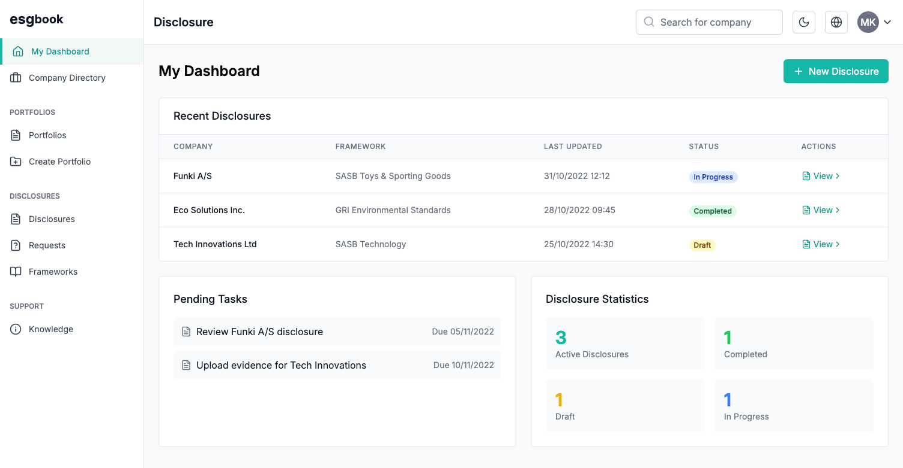
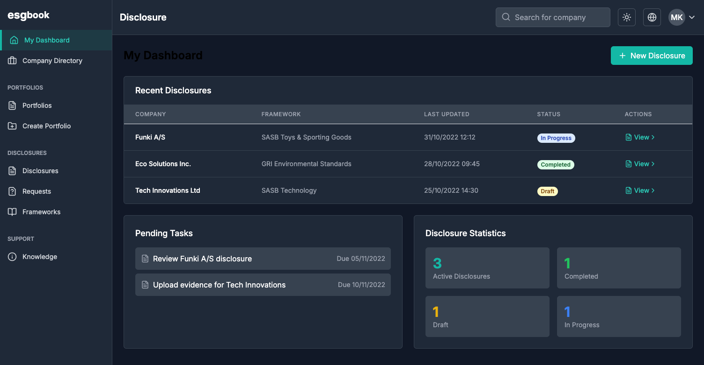

# nvDash

A comprehensive ESG (Environmental, Social, and Governance) dashboard built with React, TypeScript, and Vite.

## Prerequisites

### Install Bun
First, you need to install Bun. If you haven't installed it yet, run:

```bash
# For macOS and Linux:
curl -fsSL https://bun.sh/install | bash

# For Windows:
# Use Windows Subsystem for Linux (WSL) and follow the Linux instructions
```

Verify the installation:
```bash
bun --version
```

## Setup and Running

1. **Install dependencies:**
```bash
bun install
```

2. **Start the development servers:**
```bash
# In the project root directory
bun dev
```

This will start both the frontend and backend servers concurrently:
- Frontend: http://localhost:5174
- Backend API: http://localhost:3001

## Database Setup

To set up the database with sample data:

```bash
cd server
bun run setup-db.js
```

## Screenshots

### Light Mode


### Dark Mode


## Features

- Light/Dark mode support
- Responsive design
- Real-time data updates
- Pagination support
- Comprehensive ESG data management
- Interactive data tables and visualizations
